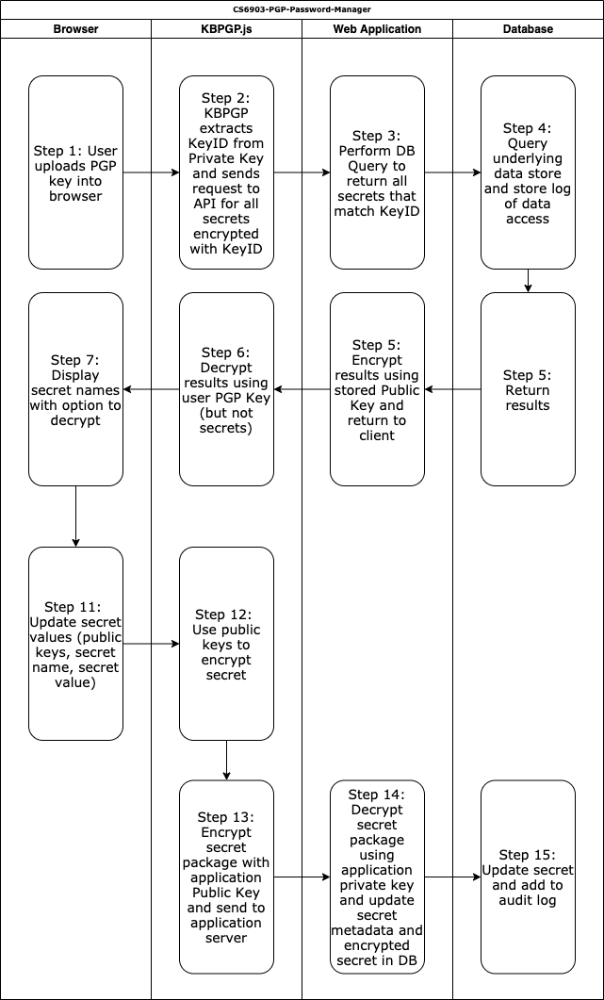

CS6903 Project 2 - Web Based Password Manager using Client Side PGP
===================================================

* Github Repository:  <https://github.com/joelbcastillo/CS6903-PGP-Password-Manager.git>

Description
-----------

This project is a web-based password manager that utilizes PGP to encrypt passwords and share them among authorized users. The application uses a frontend component (kbpgp.js) to allow users to upload their private key into the browser storage only and perform client-side operations for decrypting secrets. Allow users to upload their public key to perform client-side operations for encrypting secrets.

Requirements
------------

* Keyserver - Organizations deploying this solution will need to have a trusted keyserver to verify user public keys for encryption.
  * Default keyserver is <https://keys.openpgp.org>

### Threat Model

* Private Keys Stored in Browser
  * Threat: Users will be uploading their private key into the sessionstorage for the domain. If the key is not cleared out from sessionstorage after the user logs out (or a specified timeout period) an attacker could access the key and decrypt all of the secrets a user has access to.
  * Mitigation: When a user logs out or their session times out, the PGP Private Key will be deleted from local browser sessionstorage as designed.
* Public Key Revocation
  * Threat: Users who are no longer supposed to access data in the secret store will be able to access the secrets as long as the secret is encrypted with their public key.
  * Mitigation:
    * We will provide a simple front-end interface for revoking a user's access to one or more secrets
      * Secrets will be re-encrypted without the revoked user's public key.
* Password Hygiene
  * Threat: If a user no longer has access to the secret, but did at some point, they may have an offline copy that would allow them to use the secret.
  * Mitigation: When a user's access to secrets is revoked, a prompt will be displayed to change the secret. Currently optional, as each organization would need to establish a procedure for rotating secrets.
    * If the secret is not changed, the user would still have had access to the secret when their access was valid.
* 2-Factor Authentication Not Implemented
  * Threat: If a user's private key is compromised, the attacker would gain access to all of the user's secrets
  * Mitigation: N/A - Multi Factor / 2nd Factor authentication is currently out of scope for this project.
* Key Hijacking
  * Threat: It is possible to create a key for a user to spoof their access.
  * Mitigation: N/A - Out of scope for this application. Users should only encrypt secrets for other user's whose identities they have verified through another means.

Design
------

Authors
-------

* Ho Yin Kenneth Chan ([@kenliya](https://github.com/kenliya))
* Gary Zhou ([@g-zhou](https://github.com/g-zhou))
* Joel Castillo ([@joelbcastillo](https://github.com/joelbcastillo))
